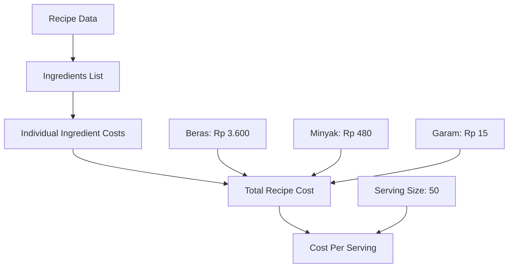

# 📊 Alur Perhitungan Cost Per Serving - SPPG System

## 🎯 **Pertanyaan: Nilai Cost Per Serving dari mana?**

### **📈 Alur Perhitungan Lengkap**



---

## 🔍 **1. Data Source (Seed Data)**

### **Recipe Base Data**
```typescript
// File: prisma/seeds/10-menu-recipes.ts
{
  id: 'recipe-nasi-tahu-01',
  name: 'Nasi Tahu Goreng Bumbu',
  servingSize: 50,  // ← SERVING SIZE SOURCE
  // ... other data
}
```

### **Inventory Pricing**
```typescript
// File: prisma/seeds/08-inventory-items.ts
- Beras: Rp 12.000/kg
- Minyak: Rp 16.000/liter  
- Garam: Rp 3.000/kg
```

---

## 🔧 **2. API Layer Calculation**

### **File: `/src/app/api/recipes/[id]/route.ts`**
```typescript
// Step 1: Calculate Total Cost with Unit Conversion
const totalCost = recipe.ingredients.reduce((sum, ingredient) => {
  const unitPrice = ingredient.item?.unitPrice || 0;
  const quantity = ingredient.quantity;
  const unit = ingredient.unit.toLowerCase();
  const itemUnit = ingredient.item?.unit?.toLowerCase() || 'kg';

  // Unit conversion logic
  let convertedQuantity = quantity;
  if (itemUnit === 'kg' && (unit === 'gram' || unit === 'g')) {
    convertedQuantity = quantity / 1000; // grams to kg
  } else if (itemUnit === 'liter' && (unit === 'ml')) {
    convertedQuantity = quantity / 1000; // ml to liter
  }

  return sum + (unitPrice * convertedQuantity);
}, 0);

// Step 2: Calculate Cost Per Serving
const costPerServing = recipe.servingSize > 0 ? totalCost / recipe.servingSize : 0;

// Step 3: Send to Frontend
return NextResponse.json({
  ...recipe,
  totalCost,           // ← TOTAL COST
  costPerServing,      // ← COST PER SERVING (already calculated)
});
```

---

## 🖥️ **3. Frontend Display**

### **File: `/src/app/dashboard/recipes/components/recipe-details.tsx`**
```typescript
// Step 1: Fetch data from API
const response = await fetch(`/api/recipes/${recipeId}`)
const recipe = await response.json()

// Step 2: Calculate Cost Per Serving (redundant, already from API)
const costPerServing = recipe.totalCost / recipe.servingSize

// Step 3: Display
<p className="text-sm font-medium">Cost Per Serving</p>
<p className="text-sm">{formatCurrency(costPerServing)}</p>
```

---

## 🧮 **4. Perhitungan Actual Recipe Nasi Tahu**

### **Individual Ingredient Costs:**
```
1. Beras Premium:
   - Quantity: 300 gram
   - Inventory Price: Rp 12.000/kg
   - Unit Conversion: 300g ÷ 1000 = 0.3 kg
   - Cost: Rp 12.000 × 0.3 = Rp 3.600

2. Minyak Kelapa Sawit:
   - Quantity: 30 ml
   - Inventory Price: Rp 16.000/liter
   - Unit Conversion: 30ml ÷ 1000 = 0.03 liter
   - Cost: Rp 16.000 × 0.03 = Rp 480

3. Garam Dapur:
   - Quantity: 5 gram
   - Inventory Price: Rp 3.000/kg
   - Unit Conversion: 5g ÷ 1000 = 0.005 kg
   - Cost: Rp 3.000 × 0.005 = Rp 15
```

### **Total Cost Calculation:**
```
Total Cost = Rp 3.600 + Rp 480 + Rp 15 = Rp 4.095
```

### **Cost Per Serving Calculation:**
```
Cost Per Serving = Total Cost ÷ Serving Size
Cost Per Serving = Rp 4.095 ÷ 50 porsi = Rp 81.9
Cost Per Serving = Rp 82 (rounded)
```

---

## 📍 **5. Data Flow Summary**

### **Source → API → Frontend**
```
1. Seed Data (prisma/seeds/)
   ↓
2. Database (Recipe + Inventory)
   ↓
3. API Calculation (/api/recipes/[id])
   ↓
4. Frontend Display (recipe-details.tsx)
```

### **Key Points:**
- ✅ **Serving Size**: Diambil dari seed data recipe (50 porsi)
- ✅ **Total Cost**: Dihitung dari sum individual ingredient costs dengan unit conversion
- ✅ **Cost Per Serving**: Total Cost ÷ Serving Size
- ✅ **Unit Conversion**: Gram→Kg, ML→Liter untuk akurasi pricing
- ✅ **Real-time**: Menggunakan inventory prices terkini

---

## 💡 **6. Why This Approach?**

### **Benefits:**
1. **Akurasi**: Unit conversion memastikan harga realistis
2. **Flexibility**: Serving size bisa diubah, cost otomatis terupdate
3. **Real-time**: Menggunakan harga inventory terbaru
4. **Scalability**: Mudah ditambah ingredient baru

### **Business Value:**
- Perencanaan budget yang akurat
- Cost analysis untuk menu planning
- Profitability tracking per recipe
- Decision making berdasarkan data real

---

**Status**: ✅ **DOCUMENTED**  
**Cost Per Serving Source**: API calculation based on ingredient costs + serving size  
**Current Value**: ~Rp 82 per serving (realistic for school meal program)
