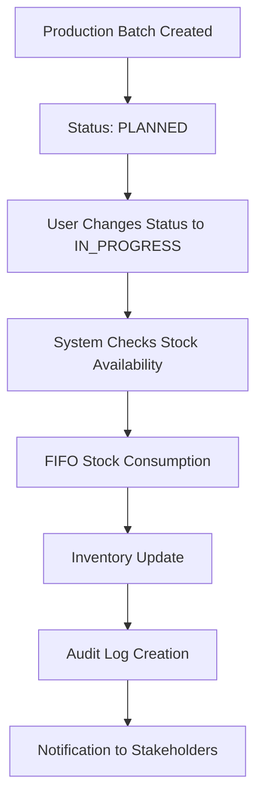

# 🔄 ANALISIS FLOW APLIKASI SPPG - BUSINESS WORKFLOW DOCUMENTATION

*Dokumen ini merupakan hasil analisis komprehensif tentang business flow dan workflow aplikasi SPPG (Sistem Pengelolaan Program Gizi).*

---

## 📋 **OVERVIEW SISTEM**

Aplikasi SPPG adalah sistem manajemen terintegrasi untuk program gizi sekolah yang mencakup procurement, production, distribution, dan quality control dalam satu platform enterprise-level.

### **Arsitektur Utama:**
- **Frontend**: Next.js 15 + TypeScript + Tailwind CSS
- **Backend**: API Routes + Prisma ORM
- **Database**: PostgreSQL
- **Authentication**: NextAuth.js dengan role-based access
- **State Management**: React Query + Local State

---

## 🏗️ **1. AUTHENTICATION & AUTHORIZATION FLOW**


### **Flow Detail:**
1. **Login** → `auth/login/page.tsx`
2. **Role Detection** → Prisma query user roles dari database
3. **Dashboard Routing** → Professional URL routing (`/home`, `/admin`, `/financial`)
4. **Permission Check** → Middleware validates access per route

### **Supported Roles:**
- `SUPER_ADMIN` → Full system access (`/admin`)
- `ADMIN` → Administrative access (`/admin`)
- `CHEF` → Kitchen operations (`/home`)
- `NUTRITIONIST` → Menu planning & nutrition (`/home`)
- `FINANCIAL_ANALYST` → Financial dashboard (`/financial`)
- `VOLUNTEER` → Basic access (`/home`)

---

## 🎯 **2. CORE BUSINESS FLOWS**

### **A. PROCUREMENT FLOW** 🛒
```
Raw Materials → Suppliers → Purchase Orders → Inventory Receipt
```

**Workflow Steps:**
1. **Raw Materials Management** (`/materials`)
   - Create/edit material master data
   - Define nutrition information
   - Set category and units

2. **Supplier Management** (`/suppliers`)
   - Manage supplier database
   - Track supplier performance
   - Handle supplier contracts

3. **Purchase Order Creation** (`/orders`)
   - Generate PO from requirements
   - Approval workflow
   - PO tracking and analytics

4. **Inventory Management** (`/inventory`)
   - Stock receipt and validation
   - FIFO inventory management
   - Stock level monitoring

### **B. MENU PLANNING FLOW** 🍽️
```
Recipe Creation → Menu Planning → Nutritional Analysis → Approval
```

**Workflow Steps:**
1. **Recipe Management** (`/recipes`)
   - Create standardized recipes
   - Define ingredients and portions
   - Calculate nutritional values

2. **Menu Planning** (`/menu-planning`)
   - Weekly/monthly menu creation
   - Calendar-based planning
   - Nutritional compliance check

3. **Nutrition Consultation** (`/nutrition-consultations`)
   - Expert review process
   - Nutritional optimization
   - Health compliance validation

4. **Quality Standards** (`/quality`)
   - Set quality parameters
   - Define testing protocols
   - Approval criteria

### **C. PRODUCTION FLOW** 🏭
```
Production Planning → Resource Allocation → Batch Execution → Quality Control
```

**Workflow Steps:**
1. **Production Planning** (`/production-plans`)
   - Demand forecasting
   - Resource requirement planning
   - Production scheduling

2. **Resource Management** (`/production/resources`)
   - Equipment allocation
   - Staff assignment
   - Capacity planning

3. **Batch Creation** (`/production/batches/from-recipe`)
   - Recipe-to-batch conversion
   - Automatic stock calculation
   - Impact preview before execution

4. **Quality Control** (`/quality-checks`)
   - In-process quality checks
   - Photo documentation
   - Pass/fail decisions

### **D. DISTRIBUTION FLOW** 🚛
```
Distribution Planning → Vehicle Assignment → Delivery Tracking → School Receipt
```

**Workflow Steps:**
1. **Distribution Planning** (`/distributions`)
   - Route optimization
   - Delivery scheduling
   - Quantity allocation per school

2. **Vehicle & Driver Assignment** (`/vehicles`, `/drivers`)
   - Fleet management
   - Driver scheduling
   - Vehicle maintenance tracking

3. **Delivery Tracking** (`/distributions/tracking`)
   - Real-time delivery status
   - GPS tracking integration
   - Delivery confirmation

4. **School Distribution** (`/distributions/schools`)
   - School-specific deliveries
   - Receipt confirmation
   - Feedback collection

---

## 🔧 **3. TECHNICAL ARCHITECTURE FLOWS**

### **A. Data Flow Architecture**
```
Client Request → Middleware → API Routes → Prisma ORM → PostgreSQL → Response Processing → Client Update
```

### **B. State Management Flow**
```
Component Mount → React Query → API Fetching → Cache Management → Local State → UI Updates → User Interaction
```

### **C. Permission Flow**
```
Route Access → Session Check → User Roles → Permission Matrix → Route Authorization → Component Rendering
```

### **D. Professional URL Routing**
```
Clean URL (/materials) → Middleware Rewrite → Internal Route (/dashboard/raw-materials) → Page Rendering
```

**URL Mapping Examples:**
- `/materials` → `/dashboard/raw-materials`
- `/menu-planning` → `/dashboard/menu-planning`
- `/suppliers` → `/dashboard/suppliers`
- `/production` → `/dashboard/production`

---

## 📊 **4. ADVANCED WORKFLOW PATTERNS**

### **A. CRUD Pattern (Standard)**
```
List View → Search/Filter → Detail View → Create/Edit Form → Validation → API Call → Success/Error → Refresh List
```

### **B. Production Batch Pattern**
```
Recipe Selection → Portion Calculation → Impact Preview → Stock Validation → Confirmation → 
Automatic Stock Deduction → Batch Creation → Quality Control → Completion Status
```

### **C. Financial Transaction Pattern**
```
Transaction Type → Category Selection → Amount Entry → Receipt Upload → 
Budget Validation → Approval Workflow → Record Creation → Reporting Integration
```

### **D. Quality Control Workflow**
```
Sample Collection → Photo Documentation → Testing Procedures → Results Recording → 
Pass/Fail Decision → Action Implementation → Report Generation
```

---

## ⚙️ **5. ADVANCED SYSTEM FEATURES**

### **A. Automatic Stock Deduction System**


**Implementation:**
- Triggered when production batch status changes to `IN_PROGRESS`
- Uses FIFO (First In, First Out) method for stock consumption
- Automatic rollback capability for cancelled batches
- Complete audit trail for all stock movements

### **B. AI Resource Optimization**
```
Data Collection → Pattern Analysis → Optimization Recommendations → 
Impact Calculation → Implementation Planning → Performance Monitoring
```

**Features:**
- Production efficiency optimization
- Resource utilization analysis
- Cost reduction recommendations
- Sustainability scoring
- ROI calculation for improvements

### **C. Real-time Monitoring Dashboard**
```
Data Aggregation → Real-time Metrics → Alert Generation → 
Visual Dashboard → Actionable Insights → Performance Tracking
```

---

## 🎨 **6. USER EXPERIENCE FLOWS**

### **A. Role-based Dashboard Experience**
```
Login → Role Detection → Personalized Landing Page → Quick Actions → 
Recent Activities → Notifications → Role-specific Navigation
```

**Dashboard Routing Logic:**
- **Admin Users** → `/admin` (System management focus)
- **Financial Users** → `/financial` (Budget and cost analysis)
- **Operations Users** → `/home` (Production and operations)

### **B. Responsive Design Flow**
```
Device Detection → Layout Adaptation → Navigation Optimization → 
Touch Interactions → Performance Optimization
```

**Implementation:**
- **Mobile**: Grid view with touch-optimized controls
- **Tablet**: Hybrid grid/table view
- **Desktop**: Full table view with advanced features

### **C. Progressive Enhancement**
```
Basic Functionality → Enhanced Features → Real-time Updates → 
AI Insights → Predictive Analytics → Automation
```

---

## 🔄 **7. INTEGRATION & API FLOWS**

### **A. External API Integration Pattern**
```
External Request → Authentication → Rate Limiting → Data Validation → 
Processing → Response Formatting → Error Handling → Logging
```

### **B. Internal API Flow**
```
Client Request → Middleware → Route Handler → Database Query → 
Data Processing → Response Generation → Client Update
```

### **C. Real-time Updates (Future)**
```
Database Change → Event Trigger → WebSocket/SSE → 
Client Notification → UI Update → User Alert
```

---

## 📈 **8. BUSINESS INTELLIGENCE & ANALYTICS**

### **A. Analytics Pipeline**
```
Raw Data Collection → ETL Processing → Data Aggregation → 
Statistical Analysis → Visualization → Insights Generation → 
Actionable Recommendations → Performance Monitoring
```

### **B. Reporting Workflow**
```
Report Request → Parameter Selection → Data Query → 
Processing → Format Generation (PDF/Excel) → Distribution → Archive
```

### **C. Financial Analytics**
```
Transaction Data → Category Analysis → Budget Comparison → 
Trend Analysis → Cost Optimization → Financial Forecasting
```

---

## 🎯 **9. CRITICAL ANALYSIS & RECOMMENDATIONS**

### **🔴 Critical Flow Gaps Identified:**

1. **Incomplete Automatic Stock Management**
   - **Issue**: Manual stock deduction process
   - **Impact**: Inventory inaccuracy, manual errors
   - **Solution**: Implement automatic FIFO stock consumption

2. **Missing Real-time Dashboard Updates**
   - **Issue**: Static dashboard data
   - **Impact**: Delayed decision making
   - **Solution**: WebSocket integration for live updates

3. **Limited Mobile Optimization**
   - **Issue**: Some flows not optimized for mobile
   - **Impact**: Poor mobile user experience
   - **Solution**: Mobile-first design implementation

4. **Manual Quality Control Processes**
   - **Issue**: Paper-based quality checks
   - **Impact**: Data loss, inconsistency
   - **Solution**: Digital quality control with AI assistance

### **🟡 Optimization Opportunities:**

1. **Batch Processing Implementation**
   - Bulk operations for improved efficiency
   - Background job processing
   - Queue management system

2. **Predictive Analytics Integration**
   - Demand forecasting
   - Inventory optimization
   - Maintenance prediction

3. **Workflow Automation**
   - Approval workflow automation
   - Notification systems
   - Auto-reporting generation

4. **Advanced Integration APIs**
   - ERP system integration
   - Government reporting APIs
   - Supplier system connectivity

### **🟢 Strong Flow Areas:**

1. **Role-based Security System**
   - Comprehensive permission matrix
   - Secure authentication flow
   - Granular access control

2. **Professional URL Architecture**
   - Clean, SEO-friendly URLs
   - Proper routing implementation
   - User-friendly navigation

3. **Component-based Architecture**
   - Modular, reusable components
   - Consistent design system
   - Maintainable codebase

4. **Strong Type Safety**
   - TypeScript implementation
   - API type safety
   - Runtime validation

---

## 🚀 **10. FUTURE ROADMAP & ENHANCEMENTS**

### **Phase 1: Core Optimization (1-3 months)**
- [ ] Implement automatic stock deduction
- [ ] Mobile UX improvements
- [ ] Real-time dashboard updates
- [ ] Performance optimization

### **Phase 2: Advanced Features (3-6 months)**
- [ ] AI-powered quality control
- [ ] Predictive analytics
- [ ] Advanced reporting system
- [ ] Workflow automation

### **Phase 3: Enterprise Integration (6-12 months)**
- [ ] ERP system integration
- [ ] Government compliance automation
- [ ] Advanced analytics dashboard
- [ ] Multi-tenant architecture

### **Phase 4: Innovation & Scale (12+ months)**
- [ ] IoT sensor integration
- [ ] Machine learning optimization
- [ ] Blockchain traceability
- [ ] Global scaling capabilities

---

## 📊 **11. KEY PERFORMANCE INDICATORS**

### **Technical KPIs:**
- **Page Load Time**: < 2 seconds
- **API Response Time**: < 500ms
- **Mobile Performance**: Lighthouse score > 90
- **System Uptime**: 99.9%

### **Business KPIs:**
- **User Adoption Rate**: Active users growth
- **Process Efficiency**: Time reduction in workflows
- **Data Accuracy**: Error reduction percentage
- **Cost Optimization**: Operational cost savings

### **User Experience KPIs:**
- **Task Completion Rate**: Successful workflow completion
- **User Satisfaction**: NPS score > 50
- **Feature Adoption**: Usage statistics per feature
- **Support Tickets**: Reduction in user issues

---

## 🔗 **12. RELATED DOCUMENTATION**

- [Professional URL Implementation](./PROFESSIONAL_URL_IMPLEMENTATION.md)
- [Automatic Stock Deduction System](./AUTOMATIC_STOCK_DEDUCTION.md)
- [Permission System Implementation](./CHEF_PERMISSION_FINAL_SUMMARY.md)
- [Professional Recommendations](./PROFESSIONAL_RECOMMENDATIONS.md)
- [Vehicle Management Implementation](./VEHICLE_MANAGEMENT_FINAL_IMPLEMENTATION.md)

---

## 📝 **CONCLUSION**

Aplikasi SPPG memiliki foundation yang solid dengan architecture yang well-designed dan comprehensive business flow coverage. Sistem ini ready untuk production dengan beberapa area optimization yang dapat meningkatkan efficiency dan user experience.

**Key Strengths:**
- ✅ Robust authentication & authorization
- ✅ Professional URL structure
- ✅ Comprehensive business workflow coverage
- ✅ Strong type safety implementation
- ✅ Responsive design implementation

**Priority Improvements:**
- 🔄 Automatic stock management
- 🔄 Real-time updates
- 🔄 Mobile UX optimization
- 🔄 AI-powered insights

---

*Dokumen ini akan diupdate secara berkala seiring dengan development progress dan feedback dari stakeholders.*

**Last Updated:** September 3, 2025  
**Version:** 1.0  
**Author:** Development Team
